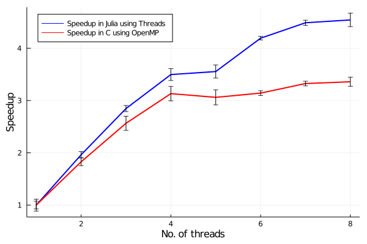

# A simple comparison of Julia and C/OpenMP for the solution of the 2D stationary diffusion equation

In this simple code a 2D stationary diffusion equation is solved using the finite difference method.

Time and Speedup are calculated using a Julia implementation and a C/OpenMP implementation.

# Mathematical problem

- Equation: d2u/dx2 + d2u/dy2 = 0
- Initial condition: u(t=0,x,y) = 0
- Boundary conditions:
  - u(t,x=0,y) = 0
  - u(t,x=1,y) = 0
  - u(t,x,y=0) = 1
  - u(t,x,y=1) = 0

# Hardware

Standard notebook:
  - Memory: 7.6 GiB
  - Processor: Intel® Core™ i5-8250U CPU @ 1.60GHz × 8 
  - OS Name: Ubuntu 20.04.1 LTS (64 bits)
  - Disck Capacity: 256.1 GB

# Results

