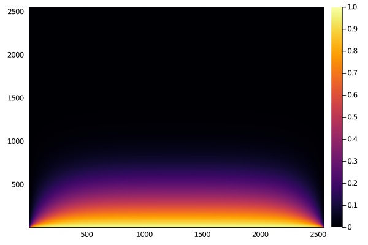
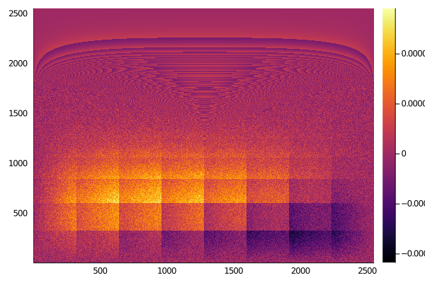

# A simple performance comparison of Julia and C/OpenMP for the solution of the 2D stationary diffusion equation

In this simple code a 2D stationary diffusion equation is solved using the finite difference method.

Time and Speedup are calculated using a Julia implementation and a C/OpenMP implementation.

## Mathematical model

- Equation: d2u/dx2 + d2u/dy2 = 0
- Initial condition: u(t=0,x,y) = 0
- Boundary conditions: u(t,x=0,y) = 0, u(t,x=1,y) = 0, u(t,x,y=0) = 1, u(t,x,y=1) = 0

## Computational Model

A simple finite difference discretization using uniform mesh was used. The constant stencil can be represented as
```
0  1  0
1 -4  1
0  1  0
```

Giving rise to stencil computations, which are conceptually simple to implement using nested loops. The following snippets show the parallel stencil computations of the present code.

- Julia:

  ```julia
  for k = 1:it_max
      @threads for j = 2:n-1
          for i = 2:n-1
              u[i,j] = (u[i+1,j]+u[i-1,j]+u[i,j+1]+u[i,j-1])/4.0
          end
      end
  end
  ```
  
- C/OpenMP:

  ```c
  for(int k=0;k<it_max;k++)
      #pragma omp parallel for collapse(2) schedule(guided)
      for(int i=1;i<n-1;i++)
          for(int j=1;j<n-1;j++)         
              u[i*n+j] = (u[(i+1)*n+j]+u[(i-1)*n+j]+u[i*n+j+1]+u[i*n+j-1])/4.0;
  ```

Unfortunately, looping implementations suffer from poor cache performance. Cache-oblivious divide-and-conquer stencil codes are much more efficient, but also hard to write (see http://supertech.csail.mit.edu/papers/pochoir_spaa11.pdf), in this case a simple looping implementation is analyzed.

## How to run

In ``run-experiments.sh`` you can set the experiment parameters:

```shell
# Experiment parameters
export NUM_THREADS=8 # Range to be evaluated: 1..NUM_THREADS
export NUM_MEASUREMENTS=30 # No. of measurements per each thread experiment
export NUM_CONVERGENCE_IT=100000 # No. of convergence iterations
export NUM_MESH_NODES=4000000 # No. of mesh nodes
```

Then you need to run the script in the GNU/Linux terminal:

```shell
$ ./run-experiments.sh
```

## Case 1: Regular Notebook

### Experiment parameters

```shell
# Experiment parameters
export NUM_THREADS=8
export NUM_MEASUREMENTS=10
export NUM_CONVERGENCE_IT=100
export NUM_MESH_NODES=6500000
```

### Software/Hardware

These experiments were executed on a conventional notebook:
  - OS Name: Ubuntu 20.04.1 LTS (64 bits)
  - Julia Version: 1.5.2
  - GCC Version: gcc (Ubuntu 9.3.0-17ubuntu1~20.04) 9.3.0
  - Memory: 7.6 GiB
  - Processor: Intel® Core™ i5-8250U CPU @ 1.60GHz × 8 
  - Disk Capacity: 256.1 GB

### Results

The following figures show the time (left) and speedup (right) obtained by both implementations, for different number of threads.
<p align="center">


</p>

The following figures show the obtained ``u`` distribution over the 2D domain (left), computed using 200000 convergence iterations instead of 100, and the neglected difference between the outcomes of both implementations (right).

<p align="center">


</p>


## Case 2: TODO
