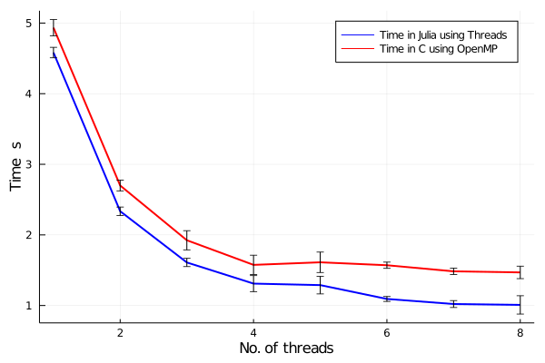

# A simple performance comparison of Julia and C/OpenMP for the solution of the 2D stationary diffusion equation

In this simple code a 2D stationary diffusion equation is solved using the finite difference method.

Time and Speedup are calculated using a Julia implementation and a C/OpenMP implementation.

## Mathematical problem

- Equation: d2u/dx2 + d2u/dy2 = 0
- Initial condition: u(t=0,x,y) = 0
- Boundary conditions:
  - u(t,x=0,y) = 0
  - u(t,x=1,y) = 0
  - u(t,x,y=0) = 1
  - u(t,x,y=1) = 0
  
## Snippets of the parallel region

- Julia:

  ```julia
  for k = 1:it_max
      @threads for j = 2:n-1
          for i = 2:n-1
              u[i,j] = (u[i+1,j]+u[i-1,j]+u[i,j+1]+u[i,j-1])/4.0
          end
      end
  end
  ```
  
- C/OpenMP:

  ```c
  for(int k=0;k<it_max;k++)
          #pragma omp parallel for collapse(2) schedule(guided)
          for(int i=1;i<n-1;i++)
              for(int j=1;j<n-1;j++)         
                  u[i*n+j] = (u[(i+1)*n+j]+u[(i-1)*n+j]+u[i*n+j+1]+u[i*n+j-1])/4.0;
  ```

Note: ``it_max = 100``, ``n = 2500``

## Hardware

Standard notebook:
  - Memory: 7.6 GiB
  - Processor: Intel® Core™ i5-8250U CPU @ 1.60GHz × 8 
  - OS Name: Ubuntu 20.04.1 LTS (64 bits)
  - Disk Capacity: 256.1 GB

## Results

<p align="center">


</p>

